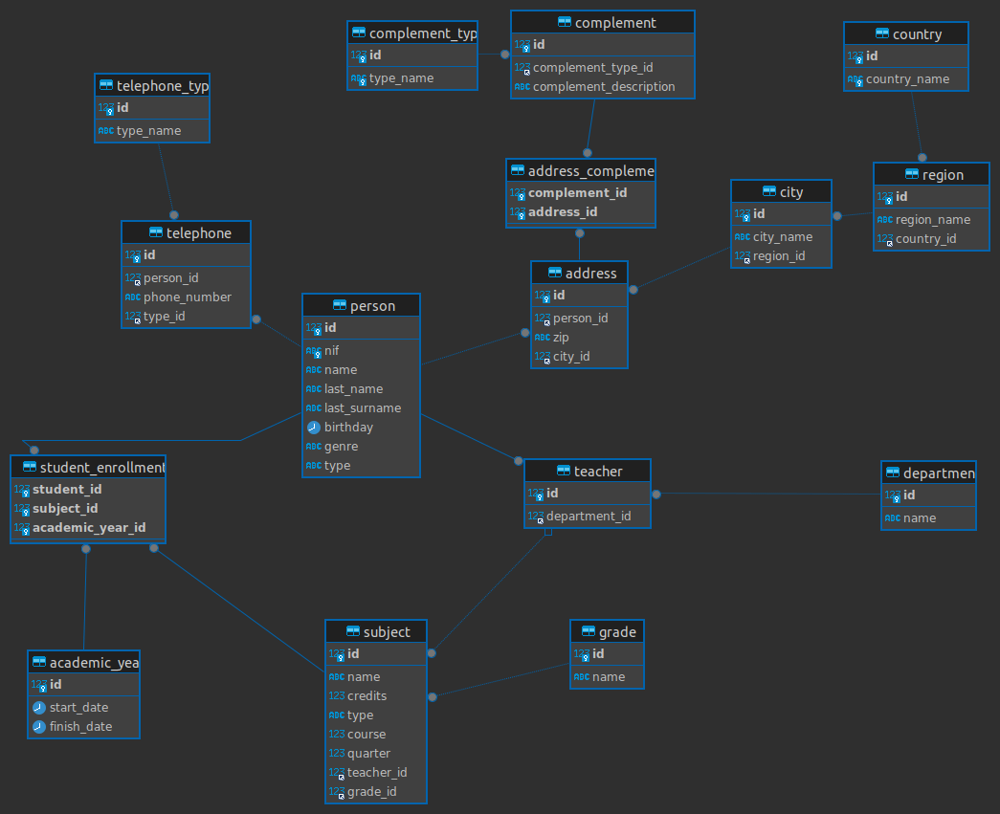

# Proyecto de base de datos (#2)


## :school:  Base de datos de universidad :school: 

Esta es una base de datos relacional hecha en SQL y gestionada por el sistema de MySQL , la cual consta de una version normalizada de una base de datos de una universidad la cual posee informacion sobre carreras, cursos, estudiantes, profesores y sus departamentos. 

Este repositorio se presenta como la segunda parte del proyecto de base de datos.

- **Base de datos original**: [universidad tipo A](https://gist.github.com/josejuansanchez/7501a91223ef2064167a15908ad5991b) 


### 👤Autoría

****

- **Nombre:** Sofia Marcela Medina Díaz.

- **Grupo:** J1

  


### 🗃️ Diagrama entidad - relación

*****





### 🔨 Creación de tablas

***

El script contenido en el archivo "universidad_tables" incluye las  tablas normalizadas de la base de datos, junto con las restricciones de  clave primaria y clave externa (foránea).

- [Script de creación de tablas](creation/universidad_tables.sql)


### 🔧 Inserción de datos + implementacion

*****

- La insercion de archivos se hace entre comandos insert y llamadas a [procedimientos](creation/insert_procedures.SQL) apoyadas por una [funcion](creation/funciones.sql), las cuales deben crearse primero.

- Para poder hacer uso de la base de datos, se hacen estos inserts iniciales:

  ```sql
  INSERT INTO country VALUES(1, 'España');
  INSERT INTO region VALUES(1,'Almería', 1 );
  INSERT INTO city VALUES(1, 'Almería',1);
  INSERT INTO complement_type(type_name) VALUES('Calle');
  INSERT INTO telephone_type(type_name) VALUES ('Fijo');
  ```

  

- Luego se ejecutan los siguientes inserts y llamadas a procedimientos que estan en la carpeta de `inserts` (con el fin de respetar las llaves foraneas):
  - `department.sql -> person.sql -> teacher.sql -> grade.sql -> academic_year.sql -> subject.sql -> student_enrollment.sql  `


### 👀 Vistas

****


1. Numero de profesores que tiene cada departamento.

```sql
CREATE OR REPLACE VIEW teachers_per_department AS
SELECT d.name AS 'nombre del departamento', 
COUNT(t.id) AS 'numero de profesores'
FROM teacher AS t
RIGHT JOIN department AS d ON d.id = t.department_id
GROUP BY d.name ORDER BY COUNT(t.id);

SELECT teachers_per_department;
```


2. listado con el nombre de todos los grados existentes en la base de datos y el número de asignaturas que tiene cada uno.

```sql
CREATE OR REPLACE VIEW subjects_per_grade AS
SELECT gr.name AS 'nombre del grado', 
COUNT(s.id) AS 'numero de materias'
FROM grade AS gr 
LEFT JOIN subject AS s ON s.grade_id = gr.id
GROUP BY gr.name 
ORDER BY COUNT(s.id) DESC;
```


3. nombre de los grados y la suma del número total de créditos que hay para cada tipo de asignatura

```sql
CREATE OR REPLACE VIEW count_subject_type AS
SELECT gr.name AS 'nombre del grado', 
su.type AS 'Tipo de asignatura', 
SUM(su.credits) AS 'Total de creditos'
FROM subject AS su
INNER JOIN grade AS gr ON gr.id = su.grade_id
GROUP BY su.type, gr.name
ORDER BY su.type DESC;
```


4. listado que muestre cuántos alumnos se han matriculado de alguna asignatura en cada uno de los cursos escolares

```sql
CREATE OR REPLACE VIEW active_students_by_course AS
SELECT  ay.id AS 'Id del curso', 
COUNT(se.student_id) AS 'Cantidad de estudiantes'
FROM student_enrollment AS se
INNER JOIN academic_year AS ay ON ay.id = se.academic_year_id
GROUP BY ay.id;
```


5. listado con el número de asignaturas que imparte cada profesor

   ```sql
   CREATE OR REPLACE VIEW subjects_per_teacher AS 
   SELECT CONCAT_WS(' ', p.name, p.last_name, p.last_surname) AS 'Nombre del profesor',
   COUNT(DISTINCT su.id) AS 'Numero de asignaturas' 
   FROM person AS p
   INNER JOIN teacher AS t ON t.id = p.id 
   LEFT JOIN subject AS su ON su.teacher_id = t.id
   GROUP BY CONCAT_WS(' ', p.name, p.last_name, p.last_surname)
   ORDER BY COUNT(su.id) DESC;
   ```


6. listado con las asignaturas que no tienen un profesor asignado

   ```sql
   CREATE OR REPLACE VIEW subjects_without_teacher AS
   SELECT su.name AS 'Nombre de la asignatura'
   FROM subject AS su
   LEFT JOIN teacher AS t ON t.id = su.teacher_id
   WHERE su.teacher_id IS NULL;
   ```

   

7. listado con los profesores que no están asociados a un departamento.

   ```sql
   CREATE OR REPLACE VIEW teachers_without_department AS 
   SELECT d.name AS 'nombre del departamento', 
   CONCAT_WS(' ', p.name, p.last_name, p.last_surname) AS 'Nombre del profesor' 
   FROM person AS p
   RIGHT JOIN teacher AS t ON t.id = p.id
   LEFT JOIN department AS d ON d.id = t.department_id 
   WHERE t.department_id IS NULL;
   ```

   

8. departamentos que no tienen profesores asociados

   ```sql
   CREATE OR REPLACE VIEW departments_without_teachers AS
   SELECT d.name AS 'nombre del departamento' 
   FROM department AS d
   LEFT JOIN teacher AS t ON d.id = t.department_id
   WHERE t.id IS NULL;
   
   ```

   

9.  listado con los nombres de todos los profesores y los departamentos que tienen vinculados

   ```sql
     CREATE OR REPLACE VIEW teachers_and_departments AS
     SELECT d.name AS 'nombre del departamento',
     CONCAT_WS(' ', p.name, p.last_name, p.last_surname) AS 'Nombre del profesor' 
     FROM person AS p
     RIGHT JOIN teacher AS t ON t.id = p.id
     LEFT JOIN department AS d ON d.id = t.department_id 
     ORDER BY p.last_name ASC, p.last_surname ASC , p.name ASC;
   ```


10. listado con todas las asignaturas ofertadas en el Grado en Ingeniería Informática (Plan 2015)

    ```sql
    CREATE OR REPLACE VIEW subjects_from_ie AS
    SELECT su.name AS 'nombre de la asignatura' FROM subject AS su
    INNER JOIN grade AS gr ON gr.id = su.grade_id
    WHERE gr.name LIKE '%Ingeniería Informática (Plan 2015)';
    ```

    


### ⚙️ Procedimientos almacenados

*****


1. Eliminar un curso

   ```sql
   DELIMITER //
   DROP PROCEDURE IF EXISTS delete_course//
   CREATE PROCEDURE delete_course(
   	IN idP INT
   )
   BEGIN
   	DELETE FROM subject WHERE idP = academic_year_id;
   	DELETE FROM academic_year WHERE idP = id;
   END//
   DELIMITER ;
   
   CALL delete_course(3);
   ```

   

2. Insercion de datos en materias

   ```sql
   DELIMITER $$
   DROP PROCEDURE IF EXISTS insert_into_subjects$$
   CREATE PROCEDURE insert_into_subjects(
       IN id INT  ,
       IN nombre VARCHAR(100)  ,
       IN creditos FLOAT UNSIGNED  ,
       IN tipo VARCHAR(20),
       IN curso TINYINT   ,
       IN cuatrimestre TINYINT   ,
       IN id_profesor INT ,
       IN id_grado INT  
   )
   BEGIN
   
   	DECLARE subject_type VARCHAR(20);
   	
   	IF tipo = 'básica' THEN
   		SET subject_type = 'Basic';
   	ELSEIF tipo = 'obligatoria' THEN
   		SET subject_type = 'Mandatory';
   	ELSE
   		SET subject_type = 'Optional';
   	END IF;
   	
   	INSERT INTO subject VALUES(id, nombre, creditos, subject_type, curso, cuatrimestre, id_profesor, id_grado);
   END$$
   DELIMITER ;
   
   CALL insert_into_subjects(1, 'Álgegra lineal y matemática discreta', 6, 'básica', 1, 1, 3, 4); -- se deben haber agregado profesores y cursos para que el procedimiento funcione
   ```

   

3. Cambiar el nombre de una persona

   ```sql
   DELIMITER $$
   DROP PROCEDURE IF EXISTS change_name$$
   CREATE PROCEDURE change_name(
       IN id_person INT,
   	IN new_name VARCHAR(25),
       IN new_last_name VARCHAR(50),
       IN new_last_surname VARCHAR(50)
   )
   BEGIN
   	UPDATE person
   	SET name = new_name, last_name = new_last_name, last_surname = new_last_surname
   	WHERE id = id_person;
   END$$
   DELIMITER ;
   
   CALL cahange_name(1, 'Juan', 'Rodriguez', 'Perez')
   ```

   

4. Buscar persona por año de nacimiento

   ```sql
   DELIMITER $$
   DROP PROCEDURE IF EXISTS search_person_by_birthday$$
   CREATE PROCEDURE search_person_by_birthday(
   	IN year_parameter INT
   )
   BEGIN
       SELECT name, last_name, last_surname FROM person
       WHERE  YEAR(birthday) = year_parameter;
   END$$
   DELIMITER ;
   CALL search_person_by_birthday(1999);
   ```


5. Buscar alumnos matriculados en cierta carrera

   ```SQL
   DELIMITER //
   DROP PROCEDURE IF EXISTS search_alumnos_by_carreer//
   CREATE PROCEDURE search_alumnos_by_carreer(in carreer_name VARCHAR(150))
   BEGIN
       SELECT DISTINCT p.id, p.nif, p.name, p.last_name, p.last_surname, g.name FROM person AS p
       INNER JOIN student_enrollment AS s ON s.student_id = p.id
       INNER JOIN subject AS su ON su.id = s.subject_id 
       INNER JOIN grade AS g ON g.id = su.grade_id
       WHERE g.name = carreer_name;
   END//
   DELIMITER ;
   
   CALL search_alumnos_by_carreer('Grado en Ingeniería Informática (Plan 2015)');
   ```

   

6. Lista de asignaturas ofertadas en cierta carrera.

   ```sql
   DELIMITER //
   DROP PROCEDURE IF EXISTS subjects_by_grade//
   CREATE PROCEDURE subjects_by_grade(IN carreer_name VARCHAR(150))
   BEGIN
   	SELECT su.name FROM subject AS su
       INNER JOIN grade AS gr ON gr.id = su.grade_id
       WHERE gr.name = carreer_name;
   
   END //
   DELIMITER ;
   
   CALL subjects_by_grade('Grado en Ingeniería Informática (Plan 2015)');
   ```


7. Listado de los profesores junto con el nombre de un departamento al que están vinculados

   ```sql
   DELIMITER //
   DROP PROCEDURE IF EXISTS teachers_by_department//
   CREATE PROCEDURE teachers_by_department(IN dep_name VARCHAR(70))
   BEGIN
       SELECT p.name, p.last_name, p.last_surname, d.name FROM person AS p
       INNER JOIN teacher AS t ON t.id = p.id
       INNER JOIN department AS d ON d.id = t.department_id
       WHERE d.name LIKE dep_name
       ORDER BY p.last_name ASC, p.last_surname ASC , p.name ASC;
   END //
   DELIMITER ;
   
   CALL teachers_by_department('Informática');
   ```

   

8. listado con el nombre de las asignaturas, año de inicio y año de fin del curso escolar del alumno con un determinado nif

   ```sql
   DELIMITER //
   DROP PROCEDURE IF EXISTS search_info_student//
   CREATE PROCEDURE search_info_student(IN nif_student VARCHAR(70))
   BEGIN
       SELECT su.name, ay.start_date, ay.finish_date FROM person AS p
       INNER JOIN student_enrollment AS se ON se.student_id = p.id 
       INNER JOIN subject AS su ON su.id = se.subject_id
       INNER JOIN academic_year AS ay ON ay.id = se.academic_year_id
       WHERE p.nif = nif_student;
   END //
   DELIMITER ;
   
   CALL search_info_student('26902806M');
   ```

   

9. Asignar un profesor a una asignatura

   ```sql
   DELIMITER //
   DROP PROCEDURE IF EXISTS asign_teacher_subject//
   CREATE PROCEDURE asign_teacher_subject(IN id_teacher_arg INT, IN id_subject_arg INT)
   BEGIN
       UPDATE subject
       SET teacher_id = id_teacher_arg
       WHERE id = id_subject_arg;
   END //
   DELIMITER ;
   
   CALL asign_teacher_subject(3, 24);
   ```

   

10. crear una nuevo departamento

    ```sql
    DELIMITER //
    DROP PROCEDURE IF EXISTS create_department//
    CREATE PROCEDURE create_department(IN department_name VARCHAR(70))
    BEGIN
    	DECLARE dE VARCHAR(70);
    	SELECT name INTO dE FROM department WHERE name like department_name;
    	IF dE IS NULL THEN
    		INSERT INTO department(name) VALUES (department_name);
    	ELSE
    		SELECT 'El nombre del nuevo departamento debe ser único' AS message;
    	END IF;
    END //
    DELIMITER ;
    
    CALL create_department('Artes');
    ```
    
    

### 🔍 Consultas


#### Consultas sobre una tabla

1. Devuelve un listado con el primer apellido, segundo apellido y el nombre de todos los alumnos. El listado deberá estar ordenado alfabéticamente de menor a mayor por el primer apellido, segundo apellido y nombre.

  ```sql
  SELECT name, last_name, last_surname FROM person
  WHERE type = 'student';
  
  +----------+------------+--------------+
  | name     | last_name  | last_surname |
  +----------+------------+--------------+
  | Salvador | Sánchez    | Pérez        |
  | Juan     | Saez       | Vega         |
  | Pedro    | Heller     | Pagac        |
  | José     | Koss       | Bayer        |
  | Ismael   | Strosin    | Turcotte     |
  | Ramón    | Herzog     | Tremblay     |
  | Daniel   | Herman     | Pacocha      |
  | Inma     | Lakin      | Yundt        |
  | Juan     | Gutiérrez  | López        |
  | Antonio  | Domínguez  | Guerrero     |
  | Irene    | Hernández  | Martínez     |
  | Sonia    | Gea        | Ruiz         |
  +----------+------------+--------------+
  
  ```

  

2. Averigua el nombre y los dos apellidos de los alumnos que no han dado de alta su número de teléfono en la base de datos.

  ```sql
  SELECT p.name, p.last_name, p.last_surname FROM person AS p
  LEFT JOIN telephone AS t ON t.person_id = p.id
  WHERE t.person_id IS NULL;
  
  +-----------+------------+--------------+
  | name      | last_name  | last_surname |
  +-----------+------------+--------------+
  | Zoe       | Ramirez    | Gea          |
  | Ismael    | Strosin    | Turcotte     |
  | Guillermo | Ruecker    | Upton        |
  | Inma      | Lakin      | Yundt        |
  | Francesca | Schowalter | Muller       |
  | Antonio   | Domínguez  | Guerrero     |
  | Irene     | Hernández  | Martínez     |
  | Sonia     | Gea        | Ruiz         |
  +-----------+------------+--------------+
  ```

  

3. Devuelve el listado de los alumnos que nacieron en 1999.

   ```sql
   SELECT name, last_name, last_surname FROM person
   WHERE type = 'student' AND YEAR(birthday) = 1999;
   
   +---------+------------+--------------+
   | name    | last_name  | last_surname |
   +---------+------------+--------------+
   | Ismael  | Strosin    | Turcotte     |
   | Antonio | Domínguez  | Guerrero     |
   +---------+------------+--------------+
   ```

   

4. Devuelve el listado de profesores que no han dado de alta su número de teléfono en la base de datos y además su nif termina en K.

  ```sql
  SELECT p.id, p.nif, p.name, p.last_name, p.last_surname FROM person AS p
  LEFT JOIN telephone AS t ON t.person_id = p.id
  WHERE t.person_id IS NULL AND p.type = 'teacher' AND p.nif NOT LIKE '%k';
  
  +----+-----------+-----------+------------+--------------+
  | id | nif       | name      | last_name  | last_surname |
  +----+-----------+-----------+------------+--------------+
  |  3 | 11105554G | Zoe       | Ramirez    | Gea          |
  | 20 | 79221403L | Francesca | Schowalter | Muller       |
  +----+-----------+-----------+------------+--------------+
  ```

  

5. Devuelve el listado de las asignaturas que se imparten en el primer cuatrimestre, en el tercer curso del grado que tiene el identificador 7.

  ```sql
  SELECT name, quarter, course, grade_id FROM subject 
  WHERE course = 3 AND quarter = 1 AND grade_id = 7;
  
  +---------------------------------------------+---------+--------+----------+
  | name                                        | quarter | course | grade_id |
  +---------------------------------------------+---------+--------+----------+
  | Bases moleculares del desarrollo vegetal    |       1 |      3 |        7 |
  | Fisiología animal                           |       1 |      3 |        7 |
  | Metabolismo y biosíntesis de biomoléculas   |       1 |      3 |        7 |
  | Operaciones de separación                   |       1 |      3 |        7 |
  | Patología molecular de plantas              |       1 |      3 |        7 |
  | Técnicas instrumentales básicas             |       1 |      3 |        7 |
  +---------------------------------------------+---------+--------+----------+
  
  
  ```

  

#### Consultas multitabla (Composición interna)

1. Devuelve un listado con los datos de todas las alumnas que se han matriculado alguna vez en el Grado en Ingeniería Informática (Plan 2015).

  ```sql
  SELECT DISTINCT p.id, p.nif, p.name, p.last_name, p.last_surname, g.name FROM person AS p
  INNER JOIN student_enrollment AS s ON s.student_id = p.id
  INNER JOIN subject AS su ON su.id = s.subject_id 
  INNER JOIN grade AS g ON g.id = su.grade_id
  WHERE g.name LIKE '%Ingeniería Informática (Plan 2015)';
  
  +----+-----------+----------+------------+--------------+-----------------------------------------------+
  | id | nif       | name     | last_name  | last_surname | name                                          |
  +----+-----------+----------+------------+--------------+-----------------------------------------------+
  |  1 | 26902806M | Salvador | Sánchez    | Pérez        | Grado en Ingeniería Informática (Plan 2015)   |
  |  2 | 89542419S | Juan     | Saez       | Vega         | Grado en Ingeniería Informática (Plan 2015)   |
  |  4 | 17105885A | Pedro    | Heller     | Pagac        | Grado en Ingeniería Informática (Plan 2015)   |
  | 19 | 11578526G | Inma     | Lakin      | Yundt        | Grado en Ingeniería Informática (Plan 2015)   |
  | 23 | 64753215G | Irene    | Hernández  | Martínez     | Grado en Ingeniería Informática (Plan 2015)   |
  | 24 | 85135690V | Sonia    | Gea        | Ruiz         | Grado en Ingeniería Informática (Plan 2015)   |
  +----+-----------+----------+------------+--------------+-----------------------------------------------+
  
  ```

  

2. Devuelve un listado con todas las asignaturas ofertadas en el Grado en Ingeniería Informática (Plan 2015).

  ```sql
  SELECT su.name FROM subject AS su
  INNER JOIN grade AS gr ON gr.id = su.grade_id
  WHERE gr.name LIKE '%Ingeniería Informática (Plan 2015)';
  
  +---------------------------------------------------------------------------+
  | name                                                                      |
  +---------------------------------------------------------------------------+
  | Álgegra lineal y matemática discreta                                      |
  | Cálculo                                                                   |
  | Física para informática                                                   |
  | Introducción a la programación                                            |
  | Organización y gestión de empresas                                        |
  | Estadística                                                               |
  | Estructura y tecnología de computadores                                   |
  | Fundamentos de electrónica                                                |
  | Lógica y algorítmica                                                      |
  | Metodología de la programación                                            |
  | Arquitectura de Computadores                                              |
  | Estructura de Datos y Algoritmos I                                        |
  | Ingeniería del Software                                                   |
  | Sistemas Inteligentes                                                     |
  | Sistemas Operativos                                                       |
  | Bases de Datos                                                            |
  | Estructura de Datos y Algoritmos II                                       |
  | Fundamentos de Redes de Computadores                                      |
  | Planificación y Gestión de Proyectos Informáticos                         |
  | Programación de Servicios Software                                        |
  | Desarrollo de interfaces de usuario                                       |
  | Ingeniería de Requisitos                                                  |
  | Integración de las Tecnologías de la Información en las Organizaciones    |
  | Modelado y Diseño del Software 1                                          |
  | Multiprocesadores                                                         |
  | Seguridad y cumplimiento normativo                                        |
  | Sistema de Información para las Organizaciones                            |
  | Tecnologías web                                                           |
  | Teoría de códigos y criptografía                                          |
  | Administración de bases de datos                                          |
  | Herramientas y Métodos de Ingeniería del Software                         |
  | Informática industrial y robótica                                         |
  | Ingeniería de Sistemas de Información                                     |
  | Modelado y Diseño del Software 2                                          |
  | Negocio Electrónico                                                       |
  | Periféricos e interfaces                                                  |
  | Sistemas de tiempo real                                                   |
  | Tecnologías de acceso a red                                               |
  | Tratamiento digital de imágenes                                           |
  | Administración de redes y sistemas operativos                             |
  | Almacenes de Datos                                                        |
  | Fiabilidad y Gestión de Riesgos                                           |
  | Líneas de Productos Software                                              |
  | Procesos de Ingeniería del Software 1                                     |
  | Tecnologías multimedia                                                    |
  | Análisis y planificación de las TI                                        |
  | Desarrollo Rápido de Aplicaciones                                         |
  | Gestión de la Calidad y de la Innovación Tecnológica                      |
  | Inteligencia del Negocio                                                  |
  | Procesos de Ingeniería del Software 2                                     |
  | Seguridad Informática                                                     |
  +---------------------------------------------------------------------------+
  
  ```

  

3. Devuelve un listado de los profesores junto con el nombre del departamento al que están vinculados. El listado debe devolver cuatro columnas, primer apellido, segundo apellido, nombre y nombre del departamento. El resultado estará ordenado alfabéticamente de menor a mayor por los apellidos y el nombre.

  ```sql
  SELECT p.name, p.last_name, p.last_surname, d.name FROM person AS p
  INNER JOIN teacher AS t ON t.id = p.id
  INNER JOIN department AS d ON d.id = t.department_id
  ORDER BY p.last_name ASC, p.last_surname ASC , p.name ASC;
  
  +-----------+------------+--------------+---------------------+
  | name      | last_name  | last_surname | name                |
  +-----------+------------+--------------+---------------------+
  | Antonio   | Fahey      | Considine    | Economía y Empresa  |
  | Manolo    | Hamill     | Kozey        | Informática         |
  | Alejandro | Kohler     | Schoen       | Matemáticas         |
  | Cristina  | Lemke      | Rutherford   | Economía y Empresa  |
  | Micaela   | Monahan    | Murray       | Agronomía           |
  | Zoe       | Ramirez    | Gea          | Informática         |
  | Guillermo | Ruecker    | Upton        | Educación           |
  | David     | Schmidt    | Fisher       | Matemáticas         |
  | Francesca | Schowalter | Muller       | Química y Física    |
  | Esther    | Spencer    | Lakin        | Educación           |
  | Alfredo   | Stiedemann | Morissette   | Química y Física    |
  | Carmen    | Streich    | Hirthe       | Educación           |
  +-----------+------------+--------------+---------------------+
  
  ```

  

4. Devuelve un listado con el nombre de las asignaturas, año de inicio y año de fin del curso escolar del alumno con nif 26902806M.

  ```sql
  SELECT su.name, ay.start_date, ay.finish_date FROM person AS p
  INNER JOIN student_enrollment AS se ON se.student_id = p.id 
  INNER JOIN subject AS su ON su.id = se.subject_id
  INNER JOIN academic_year AS ay ON ay.id = se.academic_year_id
  WHERE p.nif = '26902806M';
  
  +-----------+----------+----------------------------------------+------------+-------------+
  | nif       | name     | name                                   | start_date | finish_date |
  +-----------+----------+----------------------------------------+------------+-------------+
  | 26902806M | Salvador | Álgegra lineal y matemática discreta   |       2014 |        2015 |
  | 26902806M | Salvador | Cálculo                                |       2014 |        2015 |
  | 26902806M | Salvador | Física para informática                |       2014 |        2015 |
  +-----------+----------+----------------------------------------+------------+-------------+
  
  ```

  

5. Devuelve un listado con el nombre de todos los departamentos que tienen profesores que imparten alguna asignatura en el Grado en Ingeniería Informática (Plan 2015).

  ```sql
  SELECT DISTINCT de.name FROM department AS de
  INNER JOIN teacher AS te ON te.department_id = de.id
  INNER JOIN subject AS su ON su.teacher_id = te.id
  INNER JOIN grade AS gr ON gr.id = su.grade_id
  WHERE gr.name = 'Grado en Ingeniería Informática (Plan 2015)';
  
  +--------------+
  | name         |
  +--------------+
  | Informática  |
  +--------------+
  
  ```

  

6. Devuelve un listado con todos los alumnos que se han matriculado en alguna asignatura durante el curso escolar 2018/2019.

  ```sql
  SELECT DISTINCT p.name, p.last_name, p.last_surname FROM person AS p
  INNER JOIN student_enrollment AS se ON se.student_id = p.id
  INNER JOIN academic_year AS ay ON ay.id = se.academic_year_id
  INNER JOIN subject AS su ON su.id = se.subject_id
  WHERE ay.start_date = 2018 AND ay.finish_date = 2019;
  
  +-------+------------+--------------+
  | name  | last_name  | last_surname |
  +-------+------------+--------------+
  | Inma  | Lakin      | Yundt        |
  | Irene | Hernández  | Martínez     |
  | Sonia | Gea        | Ruiz         |
  +-------+------------+--------------+
  
  ```

  

#### Consultas multitabla (Composición externa)

1. Devuelve un listado con los nombres de todos los profesores y los departamentos que tienen vinculados. El listado también debe mostrar aquellos profesores que no tienen ningún departamento asociado. El listado debe devolver cuatro columnas, nombre del departamento, primer apellido, segundo apellido y nombre del profesor. El resultado estará ordenado alfabéticamente de menor a mayor por el nombre del departamento, apellidos y el nombre.

  ```sql
  SELECT d.name, p.name, p.last_name, p.last_surname FROM person AS p
  RIGHT JOIN teacher AS t ON t.id = p.id
  LEFT JOIN department AS d ON d.id = t.department_id 
  ORDER BY p.last_name ASC, p.last_surname ASC , p.name ASC;
  
  +---------------------+-----------+------------+--------------+
  | name                | name      | last_name  | last_surname |
  +---------------------+-----------+------------+--------------+
  | Economía y Empresa  | Antonio   | Fahey      | Considine    |
  | Informática         | Manolo    | Hamill     | Kozey        |
  | Matemáticas         | Alejandro | Kohler     | Schoen       |
  | Economía y Empresa  | Cristina  | Lemke      | Rutherford   |
  | Agronomía           | Micaela   | Monahan    | Murray       |
  | Informática         | Zoe       | Ramirez    | Gea          |
  | Educación           | Guillermo | Ruecker    | Upton        |
  | Matemáticas         | David     | Schmidt    | Fisher       |
  | Química y Física    | Francesca | Schowalter | Muller       |
  | Educación           | Esther    | Spencer    | Lakin        |
  | Química y Física    | Alfredo   | Stiedemann | Morissette   |
  | Educación           | Carmen    | Streich    | Hirthe       |
  +---------------------+-----------+------------+--------------+
  
  ```

  

2. Devuelve un listado con los profesores que no están asociados a un departamento.

  ```sql
  SELECT d.name, p.name, p.last_name, p.last_surname FROM person AS p
  RIGHT JOIN teacher AS t ON t.id = p.id
  LEFT JOIN department AS d ON d.id = t.department_id 
  WHERE t.department_id IS NULL;
  
  Empty set (0,00 sec) -- todos los profesores estan asociados a un departamento
  ```

  

3. Devuelve un listado con los departamentos que no tienen profesores asociados.

  ```sql
  SELECT d.name 
  FROM department AS d
  LEFT JOIN teacher AS t ON d.id = t.department_id
  WHERE t.id IS NULL;
  
  +-----------------------+
  | name                  |
  +-----------------------+
  | Filología             |
  | Derecho               |
  | Biología y Geología   |
  +-----------------------+
  
  ```

  

4. Devuelve un listado con los profesores que no imparten ninguna asignatura.

   ```sql
   SELECT  p.name, p.last_name, p.last_surname FROM person AS p
   RIGHT JOIN teacher AS t ON t.id = p.id
   LEFT JOIN subject AS su ON t.id = su.teacher_id 
   WHERE su.teacher_id IS NULL;
   
   +-----------+------------+--------------+
   | name      | last_name  | last_surname |
   +-----------+------------+--------------+
   | David     | Schmidt    | Fisher       |
   | Alejandro | Kohler     | Schoen       |
   | Cristina  | Lemke      | Rutherford   |
   | Antonio   | Fahey      | Considine    |
   | Esther    | Spencer    | Lakin        |
   | Carmen    | Streich    | Hirthe       |
   | Guillermo | Ruecker    | Upton        |
   | Micaela   | Monahan    | Murray       |
   | Alfredo   | Stiedemann | Morissette   |
   | Francesca | Schowalter | Muller       |
   +-----------+------------+--------------+
   
   ```

   

5. Devuelve un listado con las asignaturas que no tienen un profesor asignado.

   ```sql
   SELECT su.name FROM subject AS su
   LEFT JOIN teacher AS t ON t.id = su.teacher_id
   WHERE su.teacher_id IS NULL;
   
   +---------------------------------------------------------------------------+
   | name                                                                      |
   +---------------------------------------------------------------------------+
   | Ingeniería de Requisitos                                                  |
   | Integración de las Tecnologías de la Información en las Organizaciones    |
   | Modelado y Diseño del Software 1                                          |
   | Multiprocesadores                                                         |
   | Seguridad y cumplimiento normativo                                        |
   | Sistema de Información para las Organizaciones                            |
   | Tecnologías web                                                           |
   | Teoría de códigos y criptografía                                          |
   | Administración de bases de datos                                          |
   | Herramientas y Métodos de Ingeniería del Software                         |
   | Informática industrial y robótica                                         |
   | Ingeniería de Sistemas de Información                                     |
   | Modelado y Diseño del Software 2                                          |
   | Negocio Electrónico                                                       |
   | Periféricos e interfaces                                                  |
   | Sistemas de tiempo real                                                   |
   | Tecnologías de acceso a red                                               |
   | Tratamiento digital de imágenes                                           |
   | Administración de redes y sistemas operativos                             |
   | Almacenes de Datos                                                        |
   | Fiabilidad y Gestión de Riesgos                                           |
   | Líneas de Productos Software                                              |
   | Procesos de Ingeniería del Software 1                                     |
   | Tecnologías multimedia                                                    |
   | Análisis y planificación de las TI                                        |
   | Desarrollo Rápido de Aplicaciones                                         |
   | Gestión de la Calidad y de la Innovación Tecnológica                      |
   | Inteligencia del Negocio                                                  |
   | Procesos de Ingeniería del Software 2                                     |
   | Seguridad Informática                                                     |
   | Biologia celular                                                          |
   | Física                                                                    |
   | Matemáticas I                                                             |
   | Química general                                                           |
   | Química orgánica                                                          |
   | Biología vegetal y animal                                                 |
   | Bioquímica                                                                |
   | Genética                                                                  |
   | Matemáticas II                                                            |
   | Microbiología                                                             |
   | Botánica agrícola                                                         |
   | Fisiología vegetal                                                        |
   | Genética molecular                                                        |
   | Ingeniería bioquímica                                                     |
   | Termodinámica y cinética química aplicada                                 |
   | Biorreactores                                                             |
   | Biotecnología microbiana                                                  |
   | Ingeniería genética                                                       |
   | Inmunología                                                               |
   | Virología                                                                 |
   | Bases moleculares del desarrollo vegetal                                  |
   | Fisiología animal                                                         |
   | Metabolismo y biosíntesis de biomoléculas                                 |
   | Operaciones de separación                                                 |
   | Patología molecular de plantas                                            |
   | Técnicas instrumentales básicas                                           |
   | Bioinformática                                                            |
   | Biotecnología de los productos hortofrutículas                            |
   | Biotecnología vegetal                                                     |
   | Genómica y proteómica                                                     |
   | Procesos biotecnológicos                                                  |
   | Técnicas instrumentales avanzadas                                         |
   +---------------------------------------------------------------------------+
   
   ```

   

6. Devuelve un listado con todos los departamentos que tienen alguna asignatura que no se haya impartido en ningún curso escolar. El resultado debe mostrar el nombre del departamento y el nombre de la asignatura que no se haya impartido nunca.

  ```sql
  SELECT d.name, su.name FROM department AS d
  JOIN teacher AS t ON d.id = t.department_id
  JOIN subject AS su ON t.id = su.teacher_id
  LEFT JOIN student_enrollment AS se ON su.id = se.subject_id
  WHERE se.subject_id IS NULL;
  
  +--------------+------------------------------------------------------+
  | name         | name                                                 |
  +--------------+------------------------------------------------------+
  | Informática  | Arquitectura de Computadores                         |
  | Informática  | Estructura de Datos y Algoritmos I                   |
  | Informática  | Ingeniería del Software                              |
  | Informática  | Sistemas Inteligentes                                |
  | Informática  | Sistemas Operativos                                  |
  | Informática  | Bases de Datos                                       |
  | Informática  | Estructura de Datos y Algoritmos II                  |
  | Informática  | Fundamentos de Redes de Computadores                 |
  | Informática  | Planificación y Gestión de Proyectos Informáticos    |
  | Informática  | Programación de Servicios Software                   |
  | Informática  | Desarrollo de interfaces de usuario                  |
  +--------------+------------------------------------------------------+
  
  ```

  

#### Consultas resumen

1. Devuelve el número total de alumnas que hay.

   ```sql
   SELECT COUNT(id) FROM person
   WHERE type = 'student';
   
   +-----------+
   | COUNT(id) |
   +-----------+
   |        12 |
   +-----------+
   
   ```

   

2. Calcula cuántos alumnos nacieron en 1999.

   ```sql
   SELECT COUNT(id) FROM person
   WHERE type = 'student' AND YEAR(birthday) = 1999;
   
   +-----------+
   | COUNT(id) |
   +-----------+
   |         2 |
   +-----------+
   ```

   

3. Calcula cuántos profesores hay en cada departamento. El resultado sólo debe mostrar dos columnas, una con el nombre del departamento y otra con el número de profesores que hay en ese departamento. El resultado sólo debe incluir los departamentos que tienen profesores asociados y
    deberá estar ordenado de mayor a menor por el número de profesores.

  ```sql
  SELECT d.name, COUNT(t.id) FROM teacher AS t
  INNER JOIN department AS d ON d.id = t.department_id
  GROUP BY d.name ORDER BY COUNT(t.id);
  
  +---------------------+-------------+
  | name                | COUNT(t.id) |
  +---------------------+-------------+
  | Agronomía           |           1 |
  | Informática         |           2 |
  | Matemáticas         |           2 |
  | Economía y Empresa  |           2 |
  | Química y Física    |           2 |
  | Educación           |           3 |
  +---------------------+-------------+
  
  ```

  

4. Devuelve un listado con todos los departamentos y el número de profesores que hay en cada uno de ellos. Tenga en cuenta que pueden existir departamentos que no tienen profesores asociados. Estos departamentos también tienen que aparecer en el listado.

  ```sql
  SELECT d.name, COUNT(t.id) FROM teacher AS t
  RIGHT JOIN department AS d ON d.id = t.department_id
  GROUP BY d.name ORDER BY COUNT(t.id);
  
  +-----------------------+-------------+
  | name                  | COUNT(t.id) |
  +-----------------------+-------------+
  | Filología             |           0 |
  | Derecho               |           0 |
  | Biología y Geología   |           0 |
  | Agronomía             |           1 |
  | Informática           |           2 |
  | Matemáticas           |           2 |
  | Economía y Empresa    |           2 |
  | Química y Física      |           2 |
  | Educación             |           3 |
  +-----------------------+-------------+
  ```

  

5. Devuelve un listado con el nombre de todos los grados existentes en la base de datos y el número de asignaturas que tiene cada uno. Tenga en cuenta que pueden existir grados que no tienen asignaturas asociadas. Estos grados también tienen que aparecer en el listado. El resultado deberá estar ordenado de mayor a menor por el número de asignaturas.

  ```sql
  SELECT gr.name, COUNT(s.id) FROM grade AS gr 
  LEFT JOIN subject AS s ON s.grade_id = gr.id
  GROUP BY gr.name 
  ORDER BY COUNT(s.id) DESC;
  
  +----------------------------------------------------------+-------------+
  | name                                                     | COUNT(s.id) |
  +----------------------------------------------------------+-------------+
  | Grado en Ingeniería Informática (Plan 2015)              |          51 |
  | Grado en Biotecnología (Plan 2015)                       |          32 |
  | Grado en Ingeniería Agrícola (Plan 2015)                 |           0 |
  | Grado en Ingeniería Eléctrica (Plan 2014)                |           0 |
  | Grado en Ingeniería Electrónica Industrial (Plan 2010)   |           0 |
  | Grado en Ingeniería Mecánica (Plan 2010)                 |           0 |
  | Grado en Ingeniería Química Industrial (Plan 2010)       |           0 |
  | Grado en Ciencias Ambientales (Plan 2009)                |           0 |
  | Grado en Matemáticas (Plan 2010)                         |           0 |
  | Grado en Química (Plan 2009)                             |           0 |
  +----------------------------------------------------------+-------------+
  
  
  ```

  

6. Devuelve un listado con el nombre de todos los grados existentes en la base de datos y el número de asignaturas que tiene cada uno, de los grados que tengan más de 40 asignaturas asociadas.

  ```sql
  SELECT gr.name, COUNT(s.id) FROM grade AS gr 
  INNER JOIN subject AS s ON s.grade_id = gr.id
  GROUP BY gr.name 
  HAVING COUNT(s.id) > 40
  ORDER BY COUNT(s.id);
  
  +-----------------------------------------------+-------------+
  | name                                          | COUNT(s.id) |
  +-----------------------------------------------+-------------+
  | Grado en Ingeniería Informática (Plan 2015)   |          51 |
  +-----------------------------------------------+-------------+
  
  ```

  

7. Devuelve un listado que muestre el nombre de los grados y la suma del número total de créditos que hay para cada tipo de asignatura. El resultado debe tener tres columnas: nombre del grado, tipo de asignatura y la suma de los créditos de todas las asignaturas que hay de ese tipo. Ordene el resultado de mayor a menor por el número total de crédidos.

  ```sql
  SELECT gr.name, su.type, SUM(su.credits) FROM subject AS su
  INNER JOIN grade AS gr ON gr.id = su.grade_id
  GROUP BY su.type, gr.name
  ORDER BY su.type DESC;
  
  +-----------------------------------------------+-----------+-----------------+
  | name                                          | type      | SUM(su.credits) |
  +-----------------------------------------------+-----------+-----------------+
  | Grado en Ingeniería Informática (Plan 2015)   | Optional  |             180 |
  | Grado en Biotecnología (Plan 2015)            | Mandatory |             120 |
  | Grado en Ingeniería Informática (Plan 2015)   | Mandatory |              54 |
  | Grado en Biotecnología (Plan 2015)            | Basic     |              60 |
  | Grado en Ingeniería Informática (Plan 2015)   | Basic     |              72 |
  +-----------------------------------------------+-----------+-----------------+
  ```

  

8. Devuelve un listado que muestre cuántos alumnos se han matriculado de alguna asignatura en cada uno de los cursos escolares. El resultado deberá mostrar dos columnas, una columna con el año de inicio del curso escolar y otra con el número de alumnos matriculados.

  ```sql
  SELECT DISTINCT ay.id, COUNT(se.student_id) FROM student_enrollment AS se
  INNER JOIN academic_year AS ay ON ay.id = se.academic_year_id
  GROUP BY ay.id;
  
  +------------+----------------------+
  | start_date | COUNT(se.student_id) |
  +------------+----------------------+
  |       2014 |                    9 |
  |       2018 |                   30 |
  +------------+----------------------+
  ```

  

9. Devuelve un listado con el número de asignaturas que imparte cada profesor. El listado debe tener en cuenta aquellos profesores que no imparten ninguna asignatura. El resultado mostrará cinco columnas: id, nombre, primer apellido, segundo apellido y número de asignaturas. El resultado estará ordenado de mayor a menor por el número de asignaturas.

  ```sql
  SELECT p.id, p.name, p.last_name, p.last_surname, COUNT(DISTINCT su.id) FROM person AS p
  INNER JOIN teacher AS t ON t.id = p.id 
  LEFT JOIN subject AS su ON su.teacher_id = t.id
  GROUP BY p.id, p.name, p.last_name, p.last_surname
  ORDER BY COUNT(su.id) DESC;
  
  +----+-----------+------------+--------------+-----------------------+
  | id | name      | last_name  | last_surname | COUNT(DISTINCT su.id) |
  +----+-----------+------------+--------------+-----------------------+
  | 14 | Manolo    | Hamill     | Kozey        |                    11 |
  |  3 | Zoe       | Ramirez    | Gea          |                    10 |
  |  5 | David     | Schmidt    | Fisher       |                     0 |
  |  8 | Cristina  | Lemke      | Rutherford   |                     0 |
  | 10 | Esther    | Spencer    | Lakin        |                     0 |
  | 12 | Carmen    | Streich    | Hirthe       |                     0 |
  | 13 | Alfredo   | Stiedemann | Morissette   |                     0 |
  | 15 | Alejandro | Kohler     | Schoen       |                     0 |
  | 16 | Antonio   | Fahey      | Considine    |                     0 |
  | 17 | Guillermo | Ruecker    | Upton        |                     0 |
  | 18 | Micaela   | Monahan    | Murray       |                     0 |
  | 20 | Francesca | Schowalter | Muller       |                     0 |
  +----+-----------+------------+--------------+-----------------------+
  
  
  ```

  

#### Subconsultas

1. Devuelve todos los datos del alumno más joven.

   ```sql
   SELECT id, nif, name, last_name, last_surname, birthday, genre, type 
   FROM person
   WHERE birthday = (
       SELECT MIN(birthday) FROM person
   );
   
   +----+-----------+--------+-----------+--------------+------------+-------+---------+
   | id | nif       | name   | last_name | last_surname | birthday   | genre | type    |
   +----+-----------+--------+-----------+--------------+------------+-------+---------+
   | 12 | 85366986W | Carmen | Streich   | Hirthe       | 1971-04-29 | F     | teacher |
   +----+-----------+--------+-----------+--------------+------------+-------+---------+
   
   ```

   

2. Devuelve un listado con los profesores que no están asociados a un departamento.

  ```sql
  SELECT p.id, p.name, p.last_name, p.last_surname FROM person AS p
  INNER JOIN teacher AS t ON t.id = p.id  
  WHERE t.id NOT IN (
  	SELECT t1.id FROM teacher AS t1
      INNER JOIN department AS de ON de.id = t1.department_id
  );
  
  Empty set (0,00 sec) -- no hay profesores que no esten asignados a ningun departamento
  
  ```

  

3. Devuelve un listado con los departamentos que no tienen profesores asociados.

  ```sql
  SELECT de.name FROM department AS de
  WHERE de.id NOT IN (
  	SELECT department_id FROM teacher 
  );
  
  +-----------------------+
  | name                  |
  +-----------------------+
  | Filología             |
  | Derecho               |
  | Biología y Geología   |
  +-----------------------+
  
  ```

  

4. Devuelve un listado con los profesores que tienen un departamento asociado y que no imparten ninguna asignatura.

  ```sql
  SELECT p.id, p.name, p.last_name, p.last_surname  FROM person AS p
  INNER JOIN teacher AS t ON t.id = p.id
  INNER JOIN department AS de ON de.id = t.department_id
  WHERE t.id NOT IN (
      SELECT teacher_id FROM subject WHERE teacher_id IS NOT NULL
  );
  
  +----+-----------+------------+--------------+
  | id | name      | last_name  | last_surname |
  +----+-----------+------------+--------------+
  |  5 | David     | Schmidt    | Fisher       |
  | 15 | Alejandro | Kohler     | Schoen       |
  |  8 | Cristina  | Lemke      | Rutherford   |
  | 16 | Antonio   | Fahey      | Considine    |
  | 10 | Esther    | Spencer    | Lakin        |
  | 12 | Carmen    | Streich    | Hirthe       |
  | 17 | Guillermo | Ruecker    | Upton        |
  | 18 | Micaela   | Monahan    | Murray       |
  | 13 | Alfredo   | Stiedemann | Morissette   |
  | 20 | Francesca | Schowalter | Muller       |
  +----+-----------+------------+--------------+
  
  
  ```

  

5. Devuelve un listado con las asignaturas que no tienen un profesor asignado.

   ```sql
   SELECT su.name FROM subject AS  su 
   WHERE NOT EXISTS (
       SELECT t.id  FROM teacher AS  t
     	WHERE t.id = su.teacher_id
   );
   
   +---------------------------------------------------------------------------+
   | name                                                                      |
   +---------------------------------------------------------------------------+
   | Ingeniería de Requisitos                                                  |
   | Integración de las Tecnologías de la Información en las Organizaciones    |
   | Modelado y Diseño del Software 1                                          |
   | Multiprocesadores                                                         |
   | Seguridad y cumplimiento normativo                                        |
   | Sistema de Información para las Organizaciones                            |
   | Tecnologías web                                                           |
   | Teoría de códigos y criptografía                                          |
   | Administración de bases de datos                                          |
   | Herramientas y Métodos de Ingeniería del Software                         |
   | Informática industrial y robótica                                         |
   | Ingeniería de Sistemas de Información                                     |
   | Modelado y Diseño del Software 2                                          |
   | Negocio Electrónico                                                       |
   | Periféricos e interfaces                                                  |
   | Sistemas de tiempo real                                                   |
   | Tecnologías de acceso a red                                               |
   | Tratamiento digital de imágenes                                           |
   | Administración de redes y sistemas operativos                             |
   | Almacenes de Datos                                                        |
   | Fiabilidad y Gestión de Riesgos                                           |
   | Líneas de Productos Software                                              |
   | Procesos de Ingeniería del Software 1                                     |
   | Tecnologías multimedia                                                    |
   | Análisis y planificación de las TI                                        |
   | Desarrollo Rápido de Aplicaciones                                         |
   | Gestión de la Calidad y de la Innovación Tecnológica                      |
   | Inteligencia del Negocio                                                  |
   | Procesos de Ingeniería del Software 2                                     |
   | Seguridad Informática                                                     |
   | Biologia celular                                                          |
   | Física                                                                    |
   | Matemáticas I                                                             |
   | Química general                                                           |
   | Química orgánica                                                          |
   | Biología vegetal y animal                                                 |
   | Bioquímica                                                                |
   | Genética                                                                  |
   | Matemáticas II                                                            |
   | Microbiología                                                             |
   | Botánica agrícola                                                         |
   | Fisiología vegetal                                                        |
   | Genética molecular                                                        |
   | Ingeniería bioquímica                                                     |
   | Termodinámica y cinética química aplicada                                 |
   | Biorreactores                                                             |
   | Biotecnología microbiana                                                  |
   | Ingeniería genética                                                       |
   | Inmunología                                                               |
   | Virología                                                                 |
   | Bases moleculares del desarrollo vegetal                                  |
   | Fisiología animal                                                         |
   | Metabolismo y biosíntesis de biomoléculas                                 |
   | Operaciones de separación                                                 |
   | Patología molecular de plantas                                            |
   | Técnicas instrumentales básicas                                           |
   | Bioinformática                                                            |
   | Biotecnología de los productos hortofrutículas                            |
   | Biotecnología vegetal                                                     |
   | Genómica y proteómica                                                     |
   | Procesos biotecnológicos                                                  |
   | Técnicas instrumentales avanzadas                                         |
   +---------------------------------------------------------------------------+
   
   ```

   

6. Devuelve un listado con todos los departamentos que no han impartido asignaturas en ningún curso escolar.

  ```sql
  SELECT DISTINCT de.name  FROM department AS de
  INNER JOIN teacher AS te ON te.department_id = de.id
  WHERE NOT EXISTS (
      SELECT su.id FROM subject AS su
      WHERE su.teacher_id = te.id
  );
  +---------------------+
  | name                |
  +---------------------+
  | Matemáticas         |
  | Economía y Empresa  |
  | Educación           |
  | Agronomía           |
  | Química y Física    |
  +---------------------+
  ```

  